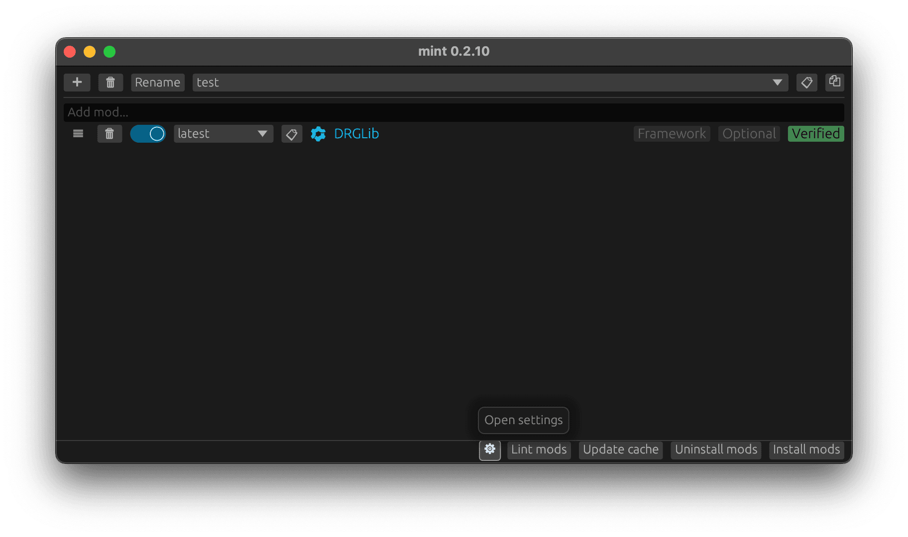
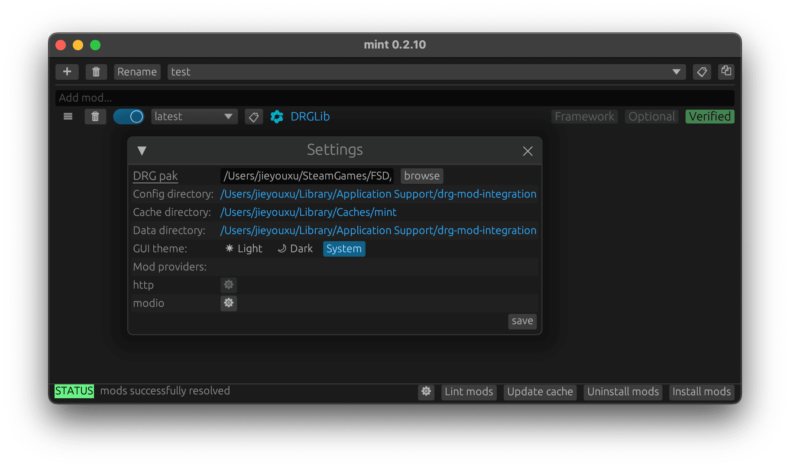
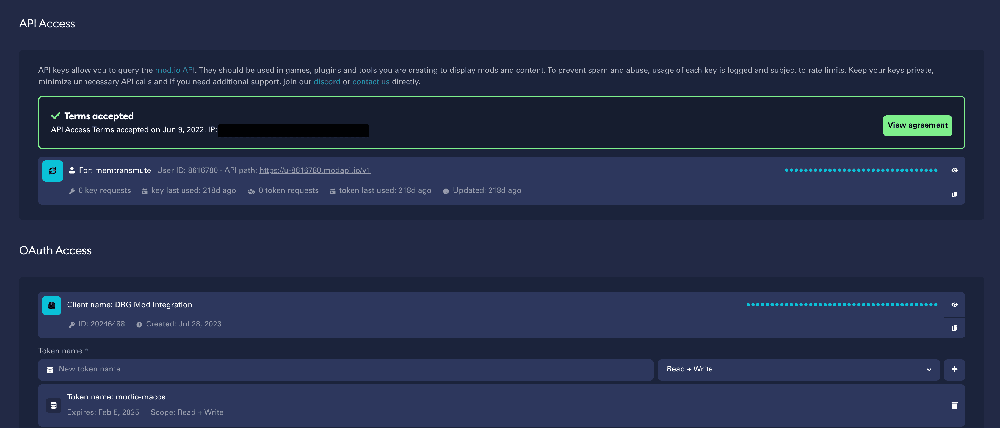
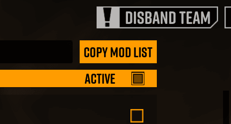

# Getting Started

To get started, you will need to download the latest Mint release, and configure settings like
mod.io authorization details and path to the game.

## Downloading the Latest Release

Mint supports both Windows and Linux platforms. You can download the latest version of Mint at
<https://github.com/trumank/mint/releases/latest>.

- For Windows users, download and extract `mint-x86_64-pc-windows-msvc.zip`.
- For Linux users, download and extract `mint-x86_64-unknown-linux-gnu.zip`.

The mint executable can be placed anywhere you like.

## Configuring Mint

Upon first usage (or if you deleted the configuration files), you will need to provide some basic
information to Mint.

### Providing the Path to your Deep Rock Galactic Installation

- Click on the cogwheel located at the bottom of the GUI to open the settings window.

    
    

- You will need to provide the path to your *Deep Rock Galactic* installation. Specifically, you
  need to provide the path to `FSD-WindowsNoEditor.pak` within the *Deep Rock Galactic*
  installation. This is usually found at e.g.
  `C:\Program Files (x86)\Steam\steamapps\common\Deep Rock Galactic\FSD\FSD-WindowsNoEditor.pak` on
  Windows. You should click on the browse button and navigate to
  `<STEAM_LIBRARY_PATH>\Deep Rock Galactic\FSD\FSD-WindowsNoEditor.pak` and select that file.

### Providing a mod.io Authentication OAuth Token

If you would like to use mods from mod.io, then you will need an *OAuth token* from mod.io. You can
generate a mod.io OAuth token at <https://mod.io/me/access>. You will need to accept the mod.io API
terms and conditions.

- You will need to add a new *client* under OAuth Access. You can call it e.g. "Mint".
- For that client, create a new token with read-only scope. You can call it e.g. "modio-access".
- Copy the generated token into the tool by clicking on the mod.io cogwheel within the
  settings window.

## Adding Mods

After providing the path to your *Deep Rock Galactic* installation and a mod.io OAuth token if you
would like to use mod.io mods, you are now ready to add mods to your current *profile*. A profile
is a collection of mods, and you can switch between profiles to easily change the set of mods that
you would like to use.

Mint supports mods from 3 kinds of sources:

1. mod.io mods: e.g. `https://mod.io/g/drg/m/sandbox-utilities`.
2. Network mods: e.g. `https://example.org/random-mod.pak`.
3. Local mods: e.g. `C:\Downloads\RandomMod.pak`

You can add mod.io and network mods by copying and pasting the mod.io or network link to the mod
into the input field and pressing enter. You can also add a local mod this way by providing the
absolute path to the local mod (e.g. `C:\Downloads\RandomMod.pak`).

For local mods, you can also add them to the current profile by dragging-and-dropping the file from
File Explorer on to the Mint window.

## Migrating from mod.io

You can make the migration from the official mod integration by:

- Subscribing to the *A Better Modding Menu* mod: <https://mod.io/g/drg/m/a-better-modding-menu>.
- Clicking the "Copy Mod URLs" button in game.

    

This will copy a list of mod.io URLs, and you can paste them into the input field inside Mint and
then press enter.
