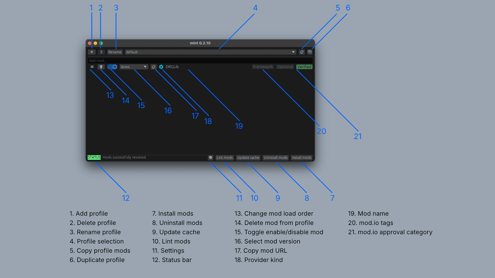

# GUI Synopsis

- Profile management; need to click Install Mods for the selected profile to take effect.
    - (1) Create a new profile
    - (2) Remove a profile
    - (3) Rename a profile
    - (4) Select a profile to become the active profile
    - (5) Copy a list of URLs for the mods in the current profile
    - (6) Duplicate the active profile; this will copy over the whole list as well as the
      enabled/disabled status and the selected mod version for every mod in that profile.
- (7) Install mods. This will install the hook and create a bundle of your enabled mods
  (`mod_P.pak`) next to the `FSD-WindowsNoEditor.pak` within your *Deep Rock Galactic* installation.
  If you toggled a mod's enabled/disabled status, changed a mod's preferred version, changed a
  profile, added/removed a mod from the active profile, etc., then you need to press Install Mods
  again for the changes to take effect. This will also disable the official mod integration system.
- (8) Uninstall mods. This will remove the hook and mod bundle, and reenable the official mod
  integration system.
- (9) Update cache. Mint maintains a *cache* (a snapshot) of your mods' current versions. If a
  mod.io mod has a new version, you will need to press Update Cache to rebuild the snapshot. The
  cache is needed to support offline usage and avoid having to redownload everything every time
  Install Mods is pressed. Need to Install Mods to take effect.
- (10) Lint mods. This opens a window which has a collection of tools to help identify if the
  selection of enabled mods in your profile may have issues, e.g. conflicting mods.
- (11) Settings. This opens a window to configure Mint. It contains inputs to allow the user to
  specify *Deep Rock Galactic* installation path, mod.io access token, select the theme, and so on.
- (12) Status bar. This will report the outcome of a major action such as Install Mods, and report
  errors encountered while trying to perform an action.
- (13) You can drag this handle to re-order mods to change their load order. The top mod is loaded
  last while the bottom mod is loaded first. This means that a mod above overwrites any conflicting
  files it may also modify as mods below it. Need to Install Mods to take effect.
- (14) Remove a mod from the current profile. Need to Install Mods to take effect.
- (15) Enable or disable a mod. Need to Install Mods to take effect.
- (16) Select mod version. You can choose which mod.io mod version to use. It is *strongly*
  recommended that you use the latest version (which is default). Use at own caution.
- (17) Copy mod URL. Copy the URL to the specific mod.
- (18) Indicator for where the mod is sourced from.
- (19) Name of the mod.
- (20) mod.io category labels.
- (21) mod.io approval category. This is verified for non-mod.io mods if they can be auto-verified
  and non-verified otherwise.
