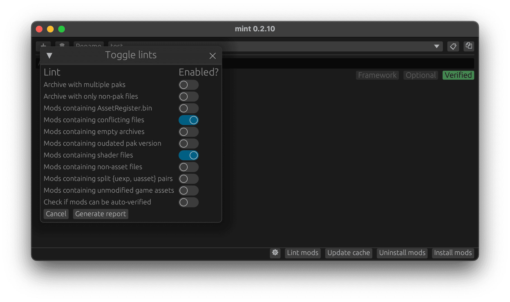
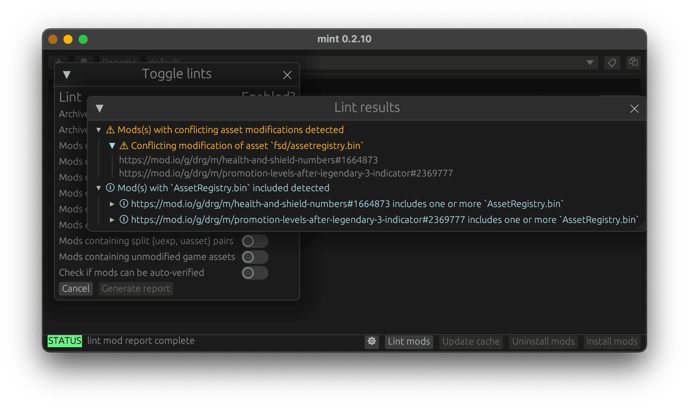

# Mod Lints

*Mod Lints* are a collection of tools that can help to detect *potential* problems such as
compatibility issues (e.g. conflicting files) with the mods in the current profile.

Currently implement lints include (maybe non-exhaustive):

- Archive with multiple paks: an archive may contain more than one mod `.pak`, but Mint will
  only load the first encountered `.pak` within the archive.
- Archive with only non-pak files: an archive does not contain a valid mod `.pak`.
- Mods containing `AssetRegister.bin`: a mod may have `AssetRegister.bin` cooked with it, which
  may indicate potential problems if the mod relies on the `AssetRegister.bin` but other mods also
  modify `AssetRegister.bin`. Note that `AssetRegister.bin` merging and handling is yet to be
  implemented.
- Mods containing conflicting files: two or more mods may modify the same file, and proper load
  order may be required to resolve the conflict, or the mods may need to be fixed, or one or more of
  the mods may need to be removed.
- Mods containing empty archives: a mod may contain an empty archive (the mod does nothing). Helpful
  to detect packaging errors when developing a mod locally.
- Mods containing outdated pak version: a mod may be cooked for an old pak version. May help to
  detect outdated mods or incorrect packaging settings.
- Mods containing shader files: sometimes a mod may contain shader files which can cause issues
  in-game. Also useful for catching incorrect packaging settings when developing mods locally.
- Mods containing non-asset files: a mod may contain non-asset files, which do not affect the game.
  This may be a packaging and/or cooking error.
- Mods containing split `.uexp`/`.uasset` pairs: usually properly cooked assets come in pairs of
  uexp and uasset extensions. Lone uexp or uasset files may indicate incorrect packaging or cooking
  settings.
- Mods containing unmodified game assets: a mod may include unmodified original game assets. This is
  usually a mistake when developing mods. Note that this lint takes a while to run because it has
  to compare original game assets with mod assets.
